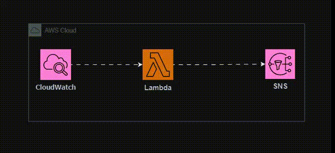
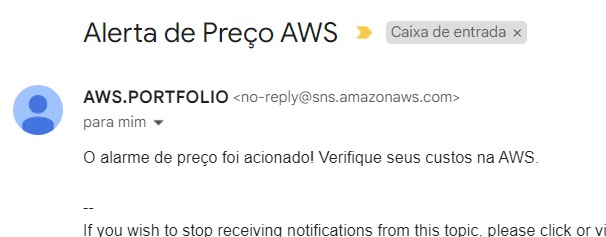

# Monitor de Alerta de Cobrança AWS

Este é um projeto que implementa um sistema de monitoramento de alerta de cobrança na AWS usando CloudWatch Events, AWS Lambda e Amazon SNS. O sistema envia notificações por e-mail quando um alarme de preço é acionado no CloudWatch.

## O que foi feito

- Implementação de uma função Lambda em Python que é acionada por eventos do CloudWatch.
- Configuração de um tópico SNS para enviar notificações por e-mail.
- Integração da função Lambda com o tópico SNS para enviar notificações quando um alarme de preço é acionado.

## Como funciona

Quando um alarme de preço é acionado no CloudWatch, um evento é gerado e enviado para a função Lambda. A função Lambda então envia uma notificação por e-mail através do tópico SNS, alertando sobre o alarme de preço. Foi criado um json que você pode vê acima, ele serve para testar a função e verificar se está ocorrendo tudo bem.

## Extensões e Usos Adicionais

Este projeto pode ser estendido de várias maneiras para atender a diferentes requisitos e cenários:

1. **Notificação por SMS**: Além de enviar notificações por e-mail, a função Lambda pode ser modificada para enviar mensagens SMS utilizando o serviço Amazon SNS SMS. Isso pode ser útil para usuários que preferem receber alertas por SMS em vez de e-mail.

2. **Outras Ações de Alerta**: Além de notificar por e-mail, a função Lambda pode ser configurada para realizar outras ações de alerta, como enviar mensagens para um sistema de mensagens instantâneas (por exemplo, Slack) ou realizar operações automáticas para reduzir custos, como desligar instâncias EC2 não utilizadas.

3. **Monitoramento de Outros Eventos**: Este projeto foi desenvolvido especificamente para monitorar alarmes de preço no CloudWatch. No entanto, o mesmo conceito pode ser aplicado para monitorar outros tipos de eventos na AWS. Por exemplo, você pode monitorar eventos de alterações em um bucket do Amazon S3 e receber alertas quando novos arquivos são adicionados.

4. **Redimensionamento de Imagens**: Além de enviar alertas, a função Lambda pode ser expandida para incluir funcionalidades adicionais, como redimensionamento automático de imagens enviadas para um bucket do Amazon S3. Isso pode ser útil para processamento de imagens em tempo real.

## Obrigado

